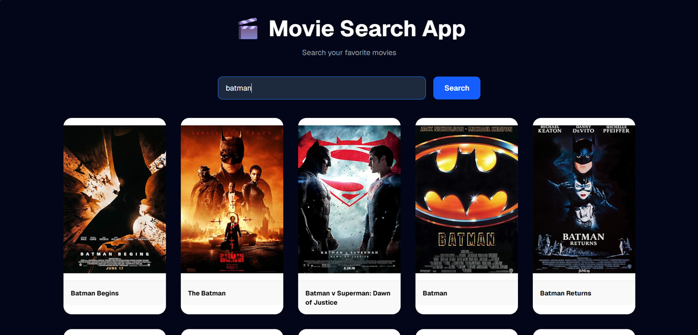

# 🎬 Movie Search App

A simple and responsive **Movie Search App** built using **React**, **Vite**, **Tailwind CSS**, and **React Router**. Users can search for movies and view their details through a clean and modern interface.

---

## 📸 Screenshot

Add your project screenshot inside the **public** folder.

```md

```

---

## ✨ Features

* 🔍 Search movies by title
* 🎬 Display movie posters
* ⭐ View movie details
* 📱 Responsive Design
* ⚡ Fast and user-friendly interface

---

## 🛠️ Tech Stack

* React
* Vite
* Tailwind CSS
* React Router
* shadcn/ui
* Lucide React

---

## 🚀 Getting Started

Clone the repository

```bash
git clone https://github.com/your-username/movies.git
```

Go to the project folder

```bash
cd movies
```

Install dependencies

```bash
npm install
```

Start the development server

```bash
npm run dev
```

---

## 📦 Build

```bash
npm run build
```

---

## 👩‍💻 Author

**Srushti Malod**
